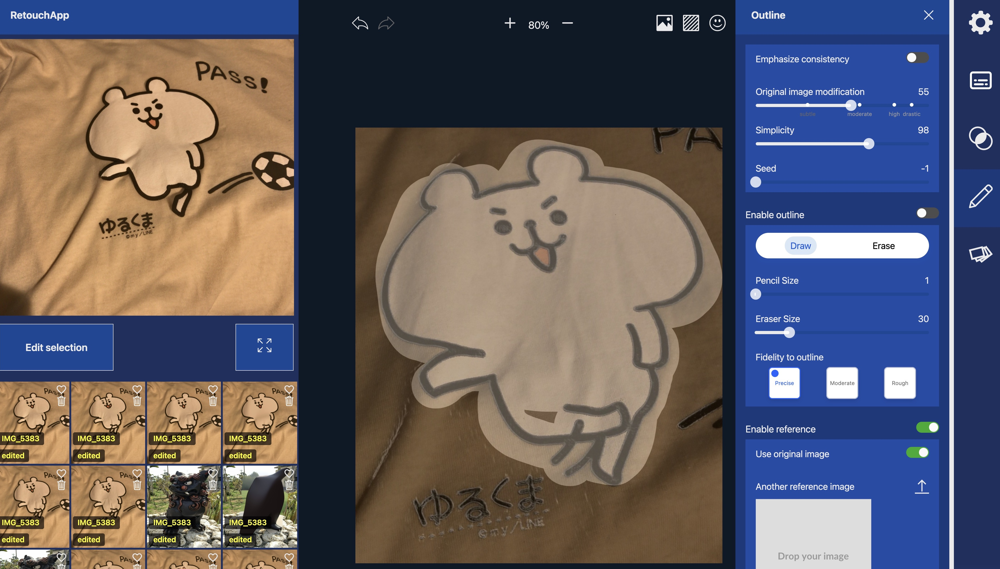
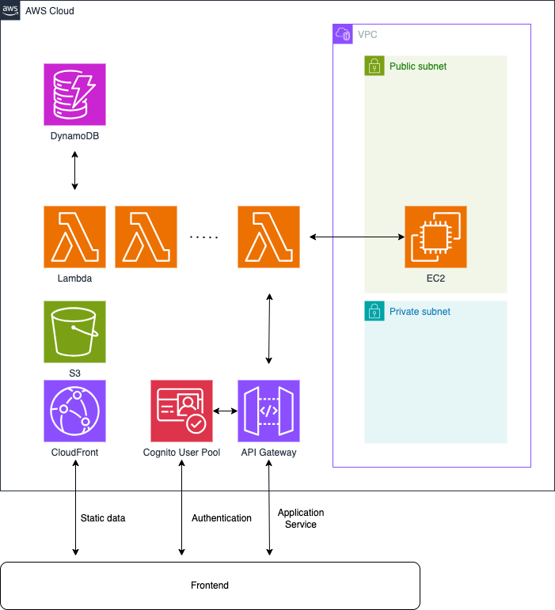

# ai-retouch-app

Stable Diffusion (SD)のオリジナルGUIクライアント。ゼロからの画像生成ではなく、画像の一部修正というユースケースに特化したアプリケーション。



## 特徴

### Main features

- 予め矩形領域で修正領域を限定した上で、インペイントで修正領域を限定する。それによって、全身画像における顔のような小さい領域も綺麗に編集が可能。
- Control-net (line art, reference)で元の構図を保ちつつ、その線を編集することも可能なので、構図を意図的に変えることも可能。
- 修正の度合いを細かく制御でき、うまく調整すればAIっぽさが全くない自然な加工も可能。

### Other features

- SDサーバの常時起動はお金がかるため、フロント側から簡単にサーバのオンオフを制御できる
- 優しくユーザフレンドリーなプロンプト(Positive/Negative)の入力方法
- 画像から初期プロンプトの抽出
- アルファブレンド
- 動画生成を見据えたバッチ処理

## 技術スタック

- プログラミング言語
  - Python
  - TypeScript
- フレームワーク / ライブラリ
  - React
  - MobX
  - CDK
  - Stable Diffusion WebUI
  - Pillow
  - Tensorflow.js
- SaaS
  - Lambda
  - API Gateway
  - Cognito
  - EC2
  - DynamoDB
  - CloudFront

## 構成

- web-frontend
- sd-service (バックエンド)
- infra (IaC)



## デプロイ手順

infra/にて

```sh
cdk deploy RetouchAppNetworkStack -c stage=staging
```

バックエンド用のEC2を手動で設定する。`backend/`参照のこと。

infra/にて

```sh
cdk deploy RetouchAppServiceStack -O deployed-resources.json -c stage=staging
```

Cognitoユーザプールに、adminユーザ(root)を手動で作成する

web-frontend/にて

```sh
npm run build
```

ビルドで動作確認したい時

```sh
 npx serve -s build
```

### ホスティング環境の準備

静的ウェブサイトのホスティング手法は説明記事が豊富なので概要だけ述べる。
解説記事は例えばこれ <https://qiita.com/ushi_osushi/items/a32d7b710567c2313faa>

- Route53でドメイン取得
- ACM(必ずus-east-1リージョン)で証明書取得
- S3に公開用バケットを用意
- CloudFrontで公開

CloudFrontを利用しているのでS3に置いたファイルがすぐには反映されない。キャッシュクリアを行う必要がある。
<https://sal-blog.com/aws-cloudfront%E3%82%AD%E3%83%A3%E3%83%83%E3%82%B7%E3%83%A5%E3%81%AE%E5%89%8A%E9%99%A4%E6%96%B9%E6%B3%95/>

## 開発実行

```sh
npm run importInfra
npm run start
```

ブラウザが`localhost:3000`で開かれるが、`localho.st:3000`とURLを打ち直して開く。Cognitoのハックのためである。詳細はZennに投稿した記事参照。
開発ユーザは以下を使う。

- ID: root
- PW: 秘密

## 設計方針

### フロントエンド

React + 状態管理としてMobXを利用

パッケージのインストール。React18に公式対応していないパッケージを導入しているため、`--force`が必要。

```sh
npm i --force
```

### インフラ

API Gatewayで受け、SDサーバにリクエストを転送する。ダイレクトなリクエストはせず間にLambdaを設け、フロントエンドから見たアプリケーションロジックが適切な複雑さになるようにする。
SDサーバ本体は、当初極力サーバレスで検討したが、まず、FargateはGPU未対応なので使えない。 EC2-backedなECSはGPUが使えるが、IPを持つことができないのでロードバランサーが必須となり、定常課金が発生する。
よって、EC2上でSDサーバを稼働させる。そのEC2インスタンスはプライベートサブネットに置くべきであるが、セットアップ等のためにインターネットアクセスをするには定常課金のNATゲートウェイが必要となる。
環境構築済みのコンテナをプライベートサブネット上のEC2で動かすのはありだが、DockerとGPUが整備された既存のAMIはなく手間がかかる。そこで利便性を考慮してアンチパターンではあるがパブリックサブネットに置く。

### バックエンド

バックエンドはEC2にWebUIにインストールするだけであることから、本レポジトリで構築資材は特に管理せず手動構築とする。ただし一部コードを修正する必要がある。
本アプリケーションと連携する上での必要な設定をここにまとめる。

#### EC2設定

RetouchAppNetworkStackを実行して作られるVPCのパブリックサブネットにEC2インスタンスを構築する。

- d4gn.xlarge
- EBS 80GB
- Name: sd-service
- VPC: ...
- サブネット: ...
- セキュリティグループ: ...
  
cdk.jsonにEC2のプライベートIPとサービスポートを打ち込む。

```typescript
{ serviceUrl: "http://10.0.0.xxx:7861" }
```

#### インストールガイド

WebUIの進化とともに変化しうるがインストール方法を記録しておく。
[バックエンドサーバ(SDサーバ)のインストール方法](./backend/sd-server-memo.md)
ControlnetのAPIの手修正も重要。

#### 起動スクリプト

systemctl unitを使う。

#### WebUIの使用法

実験をしたいときなど、SDサーバに接続してWebUIをそのまま使うことも可能である。

1. EC2インスタンスを起動する。
2. VSCodeで「SSH構成ファイルを開く」コマンドを実行し、~/.ssh/configを開く。
3. ホスト設定に以下のようホストを登録する。

```
Host sd-service
 HostName xxx.xxx.xxx.xxx
 User ec2-user
 IdentityFile /path/to/my-pem-file
```

HostNameはEC2インスタンスに割り当てられたホスト名であるが、起動のたびに変わるので毎回書き換えが必要。
楽にするためスクリプトを用意した。以下を実行する。コスト削減のためEIPを使用したくないためこのようなアプローチにしている。

```bash
sh set-sd-service-ip.sh
```


1. SSHで接続する。開くフォルダは~/stable-diffusion-webui
2. 上記起動スクリプトによって自動でAPIが起動してしまっているので止める `ps aux | grep python`で、該当しているプロセスの番号を見つけ、`kill プロセス番号` (sudoいるかも)
3. 起動コマンド `./webui.sh`
4. `localhost:xxxx`がブラウザで開きますか?と出るので開く。

なお、起動コマンドの最後に`--nowebui --listen`をつけるとAPIだけのモードとして使える。独自のオプションである`--myapp`も場合によりけりでつける。
APIだけのモードで`/docs`を開くとAPI仕様が調べられる。

